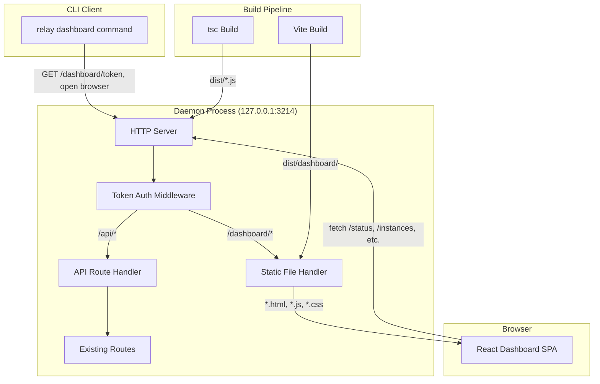

# ADR-0007: Embedded Web Dashboard via Vite + React

## Status

Proposed

## Context

The relay-agent CLI currently exposes 16 commands (init, start, stop, status, create, list, get, transcript, cancel, pause, resume, send, login, call, telegram-login, config) exclusively through the terminal. While effective for power users and AI agents, a visual interface would significantly lower the barrier for monitoring conversations, inspecting transcripts, and performing administrative operations. The dashboard must integrate into the existing daemon architecture (raw `node:http` server on `127.0.0.1:3214`) without introducing a separate server process or external dependencies at runtime.

Key constraints:
- The daemon uses raw `node:http` with no middleware framework -- all routing is manual pattern matching in `routes.ts`
- `server.ts` currently hardcodes `Content-Type: application/json` for ALL responses (line 69), which must be refactored
- The CLI already has a precedent for serving HTML: the `login.ts` command runs a temporary SSE-based QR code server on port 8787
- No authentication exists on the daemon API -- it relies solely on loopback binding (`127.0.0.1`)
- The project uses `tsc` as its only build tool -- no bundler exists in the CLI app

### Decision Summary Table

This ADR covers three related decisions:

| # | Decision | Section |
|---|----------|---------|
| 1 | Use Vite + React for the dashboard build | Dashboard Technology |
| 2 | Serve on same port under `/dashboard/*` prefix | Serving Architecture |
| 3 | Use ephemeral token authentication | Auth Mechanism |

---

## Decision 1: Dashboard Technology -- Vite + React

### Decision Details

| Item | Content |
|------|---------|
| **Decision** | Build the dashboard as a Vite + React SPA with TypeScript, bundled into static assets served by the daemon |
| **Why now** | Feature parity request for all 16 CLI commands in a visual interface; the existing HTTP server provides a natural mounting point |
| **Why this** | Vite produces optimized static bundles with content-hashed filenames ideal for embedded serving; React provides component model for complex UI (state machine visualization, transcript views, QR rendering) |
| **Known unknowns** | Optimal polling interval for real-time updates without overloading daemon; bundle size impact on CLI package distribution |
| **Kill criteria** | Dashboard bundle exceeds 2MB gzipped, or Vite build pipeline becomes incompatible with the tsc-only CLI build |

### Rationale

#### Options Considered

1. **Vite + React (Selected)**
   - Pros: Fast build times (<1s HMR), optimized production bundles with tree-shaking and code splitting, content-hashed assets for cache busting, TypeScript-first, massive ecosystem, `base` config option perfectly supports `/dashboard/` prefix
   - Cons: Adds a separate build step (Vite) alongside existing tsc, React adds ~40KB gzipped to bundle, requires coordinating two build pipelines
   - Effort: 5 days for dashboard build pipeline + core UI

2. **Plain HTML + Vanilla JavaScript**
   - Pros: Zero build step, smallest bundle size, no framework overhead, precedent exists in `login.ts` QR page (inline HTML string)
   - Cons: Inline HTML strings become unmaintainable at dashboard scale (16 commands, transcript views, state machine UI), no component reuse, manual DOM manipulation for complex interactive flows, no type safety for UI logic
   - Effort: 8 days (more code to write and maintain)

3. **Preact + esbuild**
   - Pros: Smaller bundle than React (~3KB vs ~40KB gzipped), esbuild is extremely fast, API-compatible with React
   - Cons: Smaller ecosystem than React, some React libraries incompatible, esbuild lacks Vite's HTML/asset handling and `base` config, less community support for complex UI patterns
   - Effort: 5 days

4. **htmx + Server-rendered HTML**
   - Pros: No JavaScript build pipeline needed, server-driven UI, small client footprint (<14KB)
   - Cons: Requires adding an HTML templating engine to the daemon, fundamentally changes server architecture from JSON API to HTML rendering, poor fit for complex interactive flows (QR code scanning, real-time transcript), no component model
   - Effort: 6 days

#### Comparison

| Evaluation Axis | Vite + React | Plain HTML/JS | Preact + esbuild | htmx |
|-----------------|-------------|---------------|-------------------|------|
| Build Complexity | Medium (Vite config) | None | Medium | None |
| Bundle Size | ~55-75KB gzipped (React + Tailwind CSS) | ~5KB | ~8KB gzipped | ~14KB |
| Component Reuse | Excellent | None | Excellent | Limited |
| Complex UI Support | Excellent | Poor | Good | Poor |
| TypeScript Support | Native | Manual | Native | N/A |
| Ecosystem/Libraries | Massive | N/A | Medium | Small |
| Maintainability | High | Low at scale | High | Medium |
| `/dashboard/` base path | Built-in config | Manual | Manual | Manual |

### Consequences

#### Positive
- Rich component model enables clean implementation of all 16 command UIs
- Vite's `base: '/dashboard/'` config naturally handles asset path prefixing
- Content-hashed filenames enable aggressive caching headers
- TypeScript across both daemon and dashboard ensures type consistency

#### Negative
- Two build pipelines: `tsc` for daemon, `vite build` for dashboard -- must coordinate via npm scripts
- React runtime (~40KB) plus Tailwind CSS (~15-35KB) adds ~55-75KB gzipped to the distributed package
- Dashboard source lives alongside CLI source, increasing repository complexity

#### Neutral
- Dashboard assets are fully static after build -- no server-side rendering complexity
- Polling-based updates avoid WebSocket complexity in the raw `node:http` server

### Implementation Guidance
- Configure Vite with `base: '/dashboard/'` so all asset references are correctly prefixed
- Output Vite build to a directory included in the tsc output (e.g., `dist/dashboard/`)
- Use `npm run build` to orchestrate both `tsc` and `vite build` in sequence
- Keep the React app in a separate directory within `apps/cli/` (e.g., `apps/cli/dashboard/`)

---

## Decision 2: Serving Architecture -- Same Port, Path Prefix

### Decision Details

| Item | Content |
|------|---------|
| **Decision** | Serve the dashboard on the existing daemon port 3214 under the `/dashboard/*` path prefix as static files |
| **Why now** | Adding a second port would complicate the daemon lifecycle and require additional firewall/port management |
| **Why this** | Path-based routing on the existing server is the simplest approach; the daemon already handles routing in `routes.ts` |
| **Known unknowns** | Whether serving static files from raw `node:http` introduces meaningful latency compared to dedicated static file servers |
| **Kill criteria** | Static file serving on the main server degrades API response times by >50ms |

### Rationale

#### Options Considered

1. **Same port, `/dashboard/*` prefix (Selected)**
   - Pros: Single port to manage, no additional process, dashboard auth naturally integrates with API auth, simple `open` command opens browser to `localhost:3214/dashboard/`
   - Cons: Requires refactoring `server.ts` to support non-JSON content types, static file serving code must be added to the request handler chain, slightly more complex routing logic
   - Effort: 2 days

2. **Separate port (e.g., 3215)**
   - Pros: Clean separation between API and dashboard, no routing changes needed on existing server, independent lifecycle
   - Cons: Two ports to manage/document, CORS configuration needed for dashboard to call API, separate server process or thread needed, complicates `relay dashboard` command
   - Effort: 3 days

3. **Separate process (e.g., `vite preview` or a static file server)**
   - Pros: Zero changes to existing daemon, Vite's preview server handles all static serving
   - Cons: Additional process to manage, separate port, CORS issues, defeats the purpose of an embedded dashboard, complicates packaging and distribution
   - Effort: 1 day (but poor architecture)

#### Comparison

| Evaluation Axis | Same Port | Separate Port | Separate Process |
|-----------------|-----------|---------------|------------------|
| Operational Complexity | Low (1 port) | Medium (2 ports) | High (2 processes) |
| CORS Configuration | Not needed | Required | Required |
| Auth Integration | Natural | Cross-origin | Cross-origin |
| Daemon Changes | Medium | Low | None |
| Distribution | Simple | Complex | Complex |

### Consequences

#### Positive
- Single URL for both API and dashboard simplifies usage
- No CORS configuration needed -- dashboard fetches from same origin
- Token auth applies uniformly to both dashboard pages and API calls

#### Negative
- `server.ts` must be refactored: remove hardcoded `Content-Type: application/json` on line 69, add MIME type detection for static files
- Route matching in `handleRequest` must check for `/dashboard/*` prefix before API routes

#### Neutral
- The existing `parseRoute` function in `routes.ts` will need adjustment to handle multi-segment dashboard paths

### Implementation Guidance
- Add a static file handler that maps `/dashboard/*` paths to files in the built dashboard directory
- Implement proper MIME type detection based on file extension (`.html`, `.js`, `.css`, `.svg`, etc.)
- Serve `index.html` for all `/dashboard/*` paths that do not match a static file (SPA fallback routing)
- Move `Content-Type: application/json` from `server.ts` into `sendJson` helper (which already sets it)

---

## Decision 3: Auth Mechanism -- Ephemeral Token

### Decision Details

| Item | Content |
|------|---------|
| **Decision** | Use ephemeral token authentication generated per `relay dashboard` invocation, valid only for the current daemon session |
| **Why now** | The daemon currently has zero authentication; serving a web UI without auth would expose all relay operations to any process on the machine that can open a browser |
| **Why this** | Ephemeral tokens are the simplest auth mechanism that provides session-scoped security without requiring user accounts, passwords, or persistent credentials |
| **Known unknowns** | Whether a single token per session is sufficient or if per-tab tokens are needed; token rotation strategy if the daemon runs for extended periods |
| **Kill criteria** | Token-based auth is bypassed by a local process due to a vulnerability in the implementation |

### Rationale

#### Options Considered

1. **Ephemeral token (Selected)**
   - Pros: Simple to implement (crypto.randomBytes), no persistent storage needed, naturally scoped to daemon session (invalidated on restart), token passed as query parameter or Authorization header, no user management
   - Cons: Token visible in URL if passed as query param (mitigated: localhost only), no revocation without daemon restart, single token shared across all dashboard tabs
   - Effort: 1 day

2. **No authentication**
   - Pros: Zero implementation effort, matches current API behavior
   - Cons: Any local process can access the dashboard and perform destructive operations (cancel, send messages), no audit trail, unacceptable for a UI that could be accidentally left open
   - Effort: 0 days

3. **Username/password with session cookies**
   - Pros: Familiar web auth pattern, per-session revocation, audit trail per user
   - Cons: Over-engineered for a local-only single-user tool, requires password storage (even if just in config), session management adds complexity, poor UX (must remember password)
   - Effort: 3 days

4. **mTLS (mutual TLS)**
   - Pros: Strong cryptographic authentication, no passwords
   - Cons: Extremely over-engineered for localhost, certificate management burden, browsers require manual cert installation, terrible UX
   - Effort: 5 days

#### Comparison

| Evaluation Axis | Ephemeral Token | No Auth | Username/Password | mTLS |
|-----------------|----------------|---------|-------------------|------|
| Implementation Effort | 1 day | 0 days | 3 days | 5 days |
| Security Level | Good (local) | None | Good | Excellent |
| UX Complexity | Low (auto-opens) | None | Medium (login form) | High |
| Session Scoping | Daemon lifetime | N/A | Configurable | Certificate lifetime |
| Suitability for Local CLI | Ideal | Risky | Over-engineered | Over-engineered |

### Consequences

#### Positive
- Zero-friction UX: `relay dashboard` generates token and opens browser with token in URL
- Token is invalidated when daemon restarts, providing natural session cleanup
- Middleware is simple: check `Authorization: Bearer <token>` header or `?token=<token>` query param

#### Negative
- Token visible in URL bar and browser history (mitigated: localhost-only, ephemeral)
- All dashboard tabs share the same token -- no per-tab isolation
- No token rotation during long-running daemon sessions

#### Neutral
- Auth middleware must be added to the request handler chain in `server.ts`
- Existing CLI commands (via `client.ts`) do not use auth and should not be required to

### Implementation Guidance
- Generate token using `crypto.randomBytes(32).toString('hex')` on daemon start and store in daemon memory only -- never persist to disk
- Expose token via `GET /dashboard/token` endpoint, which is exempt from auth (localhost-only access is the security boundary for this endpoint)
- The `relay dashboard` CLI command calls `GET /dashboard/token` to retrieve the token, prints the full URL, and calls `open` to launch the default browser
- Validate token on all `/dashboard/*` requests (except `GET /dashboard/token`) and all API requests that include an Authorization header
- Existing API requests without Authorization header should continue to work (backward compatible -- they are from the local CLI)
- API requests WITH an invalid Authorization header receive 401 (prevents accidental use of stale tokens)

---

## Architecture Impact Diagram

---

## Related Information

- **Client-Daemon Architecture context**: The CLI uses a client-daemon architecture where the daemon runs as an HTTP server on `127.0.0.1:3214` and CLI commands communicate via HTTP IPC (see `src/daemon/server.ts` and `src/commands/client.ts`). This decision extends the HTTP server to serve non-JSON content alongside the existing JSON API.
- **Conversation State Machine context**: The daemon manages conversation instances through an 11-state finite state machine (CREATED, QUEUED, ACTIVE, WAITING_FOR_REPLY, WAITING_FOR_AGENT, PAUSED, COMPLETED, FAILED, ABANDONED, CANCELLED, EXPIRED) defined in `src/engine/state-machine.ts`. The dashboard must visualize all states and transitions.
- **Existing precedent**: `apps/cli/src/commands/login.ts` already serves HTML + SSE on a temporary port for QR code scanning -- this ADR formalizes and expands that pattern

## References

- [Vite Backend Integration Guide](https://vite.dev/guide/backend-integration) - Official guide for serving Vite-built assets from a backend server
- [Vite Static Asset Handling](https://vite.dev/guide/assets) - How Vite handles static assets and content hashing
- [Complete Guide to React with TypeScript and Vite 2026](https://medium.com/@robinviktorsson/complete-guide-to-setting-up-react-with-typescript-and-vite-2025-468f6556aaf2) - Setup patterns
- [Ephemeral Tokens vs IDs and Passwords for DevOps](https://delinea.com/blog/ephemeral-tokens-passwords-devops) - Security rationale for ephemeral tokens
- [CLI Authentication Best Practices](https://workos.com/blog/best-practices-for-cli-authentication-a-technical-guide) - Patterns for CLI-to-web authentication
- [Token Best Practices - Auth0](https://auth0.com/docs/secure/tokens/token-best-practices) - Token security guidelines
- [Bearer Token Authentication Guide](https://securityboulevard.com/2026/01/bearer-tokens-explained-complete-guide-to-bearer-token-authentication-security/) - Bearer token patterns

---

*Document version: 1.1*
*Created: 2026-02-21*
*Updated: 2026-02-21*
*Status: Proposed*
