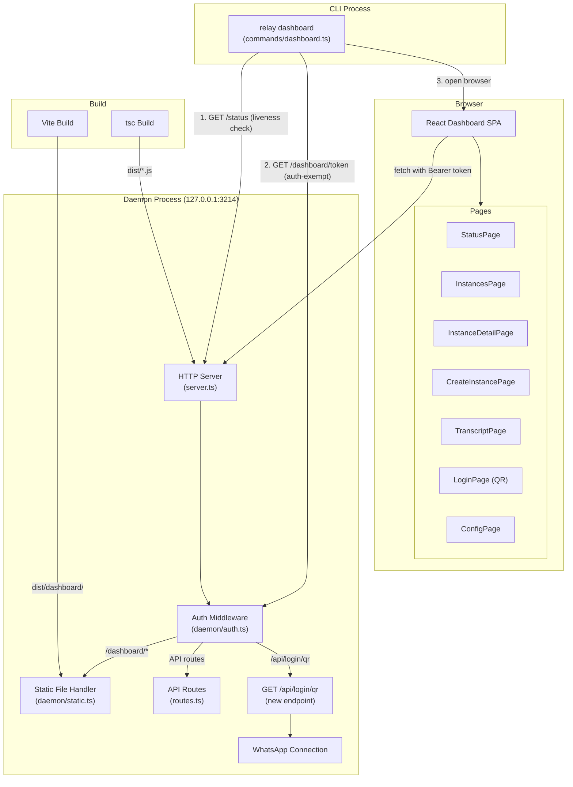
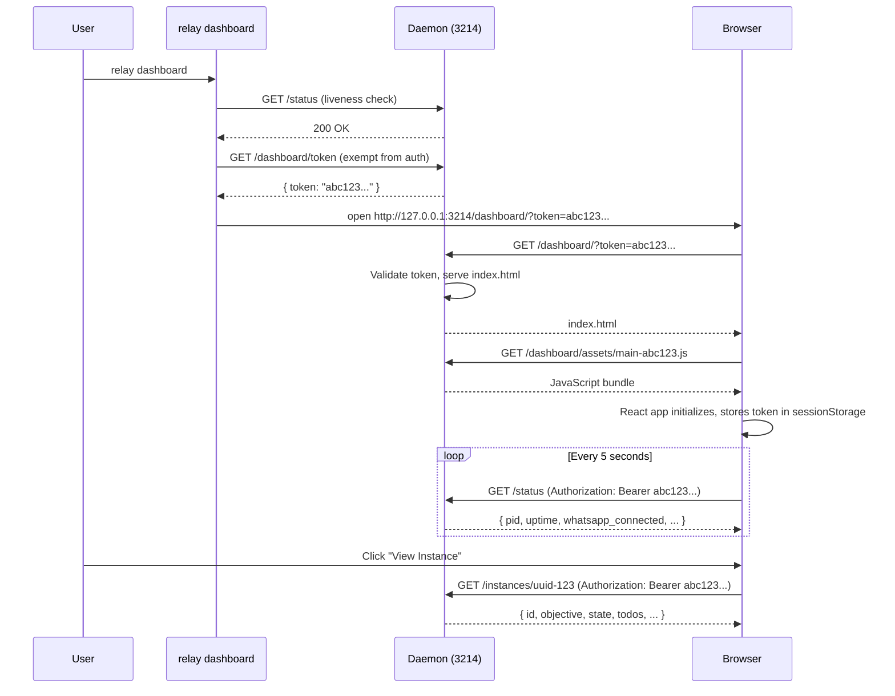
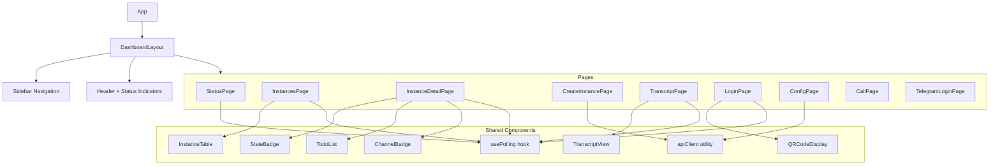

# Dashboard Command Design Document

## Overview

This document details the technical design for adding a `relay dashboard` CLI command that serves an embedded React-based web dashboard from the daemon's HTTP server at `127.0.0.1:3214/dashboard/*`. The dashboard provides full feature parity with all 16 CLI commands, including interactive flows like WhatsApp QR code login.

## Design Summary (Meta)

```yaml
design_type: "new_feature"
risk_level: "medium"
complexity_level: "high"
complexity_rationale: >
  (1) Feature parity with 16 CLI commands requires implementing each as a dashboard UI component,
  including interactive flows (QR login, real-time transcript updates, state machine visualization).
  (2) Requires refactoring the existing HTTP server to support non-JSON content types, adding auth
  middleware to a raw node:http server with no middleware framework, and introducing a second build
  pipeline (Vite) alongside tsc.
main_constraints:
  - "Raw node:http server with no middleware -- auth and static serving must integrate manually"
  - "server.ts hardcodes Content-Type: application/json for ALL responses"
  - "No bundler exists -- tsc only, must add Vite without disrupting existing build"
  - "Polling-based updates only (no WebSockets)"
biggest_risks:
  - "Server refactoring breaks existing API behavior"
  - "Dashboard bundle size inflates CLI package"
  - "Polling frequency tradeoff: too fast overloads daemon, too slow feels stale"
unknowns:
  - "Optimal polling interval for acceptable real-time feel"
  - "Whether QR code data can be exposed via API without breaking Baileys auth flow"
```

## Background and Context

### Prerequisite ADRs

- **ADR-0007**: Dashboard Technology (Vite + React), Serving Architecture (same port `/dashboard/*`), Auth Mechanism (ephemeral token)

### Inlined Architecture Context

- **Client-Daemon Architecture**: The CLI uses a client-daemon model where the daemon runs as an HTTP server on `127.0.0.1:3214` and CLI commands communicate via HTTP IPC (see `src/daemon/server.ts` and `src/commands/client.ts`). The daemon uses raw `node:http` with manual routing in `routes.ts`. This feature extends the HTTP server to serve non-JSON content.
- **Conversation State Machine**: The daemon manages conversation instances through an 11-state finite state machine (CREATED, QUEUED, ACTIVE, WAITING_FOR_REPLY, WAITING_FOR_AGENT, PAUSED, COMPLETED, FAILED, ABANDONED, CANCELLED, EXPIRED) defined in `src/engine/state-machine.ts`. Terminal states trigger cleanup callbacks. The dashboard must visualize all states and transitions.

### Agreement Checklist

#### Scope
- [x] New `relay dashboard` CLI command
- [x] React dashboard SPA built with Vite
- [x] Static file serving from daemon HTTP server under `/dashboard/*`
- [x] Ephemeral token authentication middleware
- [x] Refactoring `server.ts` to remove hardcoded JSON content-type
- [x] Full feature parity: all 16 CLI commands accessible from dashboard (including `call` and `telegram-login` for feature parity)
- [x] QR code rendering in browser for WhatsApp login
- [x] Polling-based real-time updates

#### Non-Scope (Explicitly not changing)
- [x] Existing CLI commands and their behavior -- no modifications
- [x] Existing API endpoint contracts -- responses remain identical
- [x] WhatsApp connection module (`whatsapp/connection.ts`) -- no changes to Baileys integration
- [x] State machine logic (`engine/state-machine.ts`) -- no state or transition changes
- [x] Storage layer (lowdb stores) -- no schema changes
- [x] `apps/web/` Next.js landing page -- completely independent

#### Constraints
- [x] Parallel operation: Yes -- dashboard and CLI must work simultaneously
- [x] Backward compatibility: Required -- existing CLI commands and API must not break
- [x] Performance measurement: Not required for v1 -- monitor polling overhead informally

#### Applicable Standards
- [x] TypeScript strict mode `[explicit]` - Source: `apps/cli/tsconfig.json` (`"strict": true`)
- [x] ESM modules (NodeNext) `[explicit]` - Source: `apps/cli/package.json` (`"type": "module"`)
- [x] pino for logging `[explicit]` - Source: `CLAUDE.md`, `src/utils/logger.ts`
- [x] Commander.js command registration pattern `[implicit]` - Evidence: all `src/commands/*.ts` use `registerXxxCommand(program)` pattern - Confirmed: Yes
- [x] `daemonRequest` client pattern `[implicit]` - Evidence: `src/commands/client.ts` used by all CLI commands to call daemon - Confirmed: Yes
- [x] Brand styling: dark #0a0a0a bg, glass UI, JetBrains Mono, muted blue/cyan `[explicit]` - Source: `CLAUDE.md`
- [x] Phone numbers in E.164 format `[explicit]` - Source: `CLAUDE.md`

### Problem to Solve

Relay-agent's terminal-only interface requires memorizing 16 commands with their arguments and options. Monitoring active conversations, reading transcripts, and managing instance lifecycle requires repeated CLI invocations. There is no visual overview of system state, no way to see conversation transcripts in real-time, and no browser-based WhatsApp QR code scanning (the `login.ts` QR server is a temporary workaround on a separate port).

### Current Challenges

1. **No visual overview**: Checking system state requires `relay status`, `relay list`, and individual `relay get <id>` calls
2. **Transcript reading is cumbersome**: `relay transcript <id>` outputs plain text; no scrollable, real-time view
3. **QR login is terminal-bound**: The `login --browser` flag starts a separate HTTP server on port 8787 -- a temporary workaround, not integrated with the daemon
4. **No batch operations**: Cannot pause/resume/cancel multiple instances from a single view
5. **State machine is invisible**: Users cannot see the current state of the conversation lifecycle visually

### Requirements

#### Functional Requirements

- FR-1: `relay dashboard` command starts the dashboard experience (token generation, browser launch)
- FR-2: Dashboard provides feature parity with all 16 CLI commands
- FR-3: QR codes for WhatsApp login render as scannable images in the browser
- FR-4: Dashboard displays real-time conversation state updates via polling
- FR-5: Ephemeral token authentication protects dashboard access
- FR-6: Dashboard served on same port 3214 under `/dashboard/*` prefix

#### Non-Functional Requirements

- **Performance**: Polling interval of 3-5 seconds; API responses remain under 100ms
- **Reliability**: Dashboard failure must not affect daemon or CLI operations
- **Maintainability**: Dashboard code isolated in its own directory with independent build

## Acceptance Criteria (AC) - EARS Format

### FR-1: Dashboard Command

- [ ] **When** user runs `relay dashboard`, the system shall generate an ephemeral auth token, print the dashboard URL to stdout, and open the URL in the default browser
- [ ] **If** the daemon is not running, **then** the system shall display "Daemon not running. Run `relay start` first." and exit with code 1
- [ ] **If** a token already exists for the current daemon session, **then** the system shall reuse the existing token rather than generating a new one

### FR-2: Feature Parity

- [ ] **When** user navigates to the dashboard, the system shall display a sidebar or navigation listing all available operations: Status, Instances (list/create/get), Transcripts, Send, Pause, Resume, Cancel, Init, Login, Call, Telegram Login, Config
- [ ] **When** user clicks "Create Instance", the system shall present a form with fields for objective, target_contact, todos, channel, heartbeat_config and submit via POST /instances
- [ ] **When** user views an instance detail page, the system shall display instance state, objective, target contact, todos with status, heartbeat config, and channel
- [ ] **When** user clicks Pause/Resume/Cancel on an instance, the system shall send the corresponding POST request and update the displayed state

### FR-3: QR Code Login

- [ ] **When** user initiates WhatsApp login from the dashboard, the system shall display a QR code image that refreshes automatically when a new QR is generated
- [ ] **When** WhatsApp connection is established after QR scan, the system shall display a success message and update the connection status indicator

### FR-4: Real-time Updates

- [ ] **While** the dashboard is open, the system shall poll GET /status every 5 seconds and update the status indicators (WhatsApp connected, instance counts, uptime)
- [ ] **While** viewing an instance detail or transcript, the system shall poll the relevant endpoint every 3 seconds and append new data

### FR-5: Authentication

- [ ] **When** a request to `/dashboard/*` (except `GET /dashboard/token`) lacks a valid token, the system shall return HTTP 401 with `{"error": "Unauthorized"}`
- [ ] **When** an API request (non-dashboard path) includes an `Authorization` header with an invalid token, the system shall return HTTP 401 with `{"error": "Unauthorized"}`
- [ ] **When** an API request (non-dashboard path) does NOT include an `Authorization` header, the system shall pass the request through without authentication (backward compatibility with CLI commands)
- [ ] **If** the token is passed as a `?token=` query parameter on the initial page load, **then** the system shall store it in memory (sessionStorage) and use it as an Authorization header for subsequent API calls
- [ ] The system shall accept tokens via `Authorization: Bearer <token>` header
- [ ] `GET /dashboard/token` shall be exempt from auth and return the current daemon session token (localhost-only access is the security boundary)

### FR-6: Transcript Viewing

- [ ] **When** user navigates to a transcript page for an instance, the system shall display all messages in a scrollable chat-style view with sender, timestamp, and message content
- [ ] **While** viewing a transcript, the system shall poll `GET /instances/:id/transcript` every 3 seconds and append new messages without losing scroll position

### FR-7: Message Sending

- [ ] **When** user submits a message from the instance detail page, the system shall send `POST /instances/:id/send` with the message body and display a success/failure indicator
- [ ] **If** the instance is not in a state that accepts messages, **then** the send button shall be disabled with a tooltip explaining why

### FR-8: Config Operations

- [ ] **When** user navigates to the Config page, the system shall display the current configuration retrieved via `GET /config`
- [ ] **When** user edits and saves configuration, the system shall send `POST /config` with the updated values and display a success/failure indicator

### FR-9: Call Command

- [ ] **When** user navigates to the Call page, the system shall present a form with fields matching the `relay call` command parameters (target phone number, objective)
- [ ] **When** user submits the call form, the system shall send `POST /call` and display the call initiation status

### FR-10: Telegram Login

- [ ] **When** user initiates Telegram login from the dashboard, the system shall present the Telegram authentication flow via `POST /telegram/login`
- [ ] **When** Telegram authentication completes, the system shall display a success message and update the connection status indicator

### FR-11: Serving Architecture

- [ ] The system shall serve the dashboard SPA's `index.html` for GET `/dashboard/` and any `/dashboard/*` path that does not match a static file
- [ ] The system shall serve static assets (`.js`, `.css`, `.svg`, `.png`) with correct MIME types and cache headers
- [ ] API endpoints (`/status`, `/instances`, etc.) shall continue to respond with `Content-Type: application/json`

## Existing Codebase Analysis

### Implementation Path Mapping

| Type | Path | Description |
|------|------|-------------|
| Existing | `apps/cli/src/daemon/server.ts` | HTTP server -- must refactor Content-Type handling |
| Existing | `apps/cli/src/daemon/routes.ts` | Route handler -- must add `/dashboard/*` prefix handling and auth check |
| Existing | `apps/cli/src/index.ts` | CLI entry -- must register new `dashboard` command |
| Existing | `apps/cli/src/commands/client.ts` | Daemon HTTP client -- used by `dashboard` command to check daemon liveness |
| Existing | `apps/cli/src/commands/login.ts` | WhatsApp login with QR SSE server -- pattern reference for QR flow |
| Existing | `apps/cli/package.json` | Must add `vite`, `react`, `react-dom` dependencies and build scripts |
| Existing | `apps/cli/tsconfig.json` | No changes needed -- `rootDir` is `./src`, so `dashboard/` at `apps/cli/dashboard/` is already excluded from tsc |
| New | `apps/cli/src/commands/dashboard.ts` | New CLI command: token generation, browser open |
| New | `apps/cli/src/daemon/auth.ts` | Token generation and validation module |
| New | `apps/cli/src/daemon/static.ts` | Static file serving handler with MIME type detection |
| New | `apps/cli/dashboard/` | React dashboard source (Vite project) |
| New | `apps/cli/dashboard/vite.config.ts` | Vite config with `base: '/dashboard/'` |
| New | `apps/cli/dashboard/src/` | React components, pages, hooks, styles |
| New | `apps/cli/dashboard/index.html` | SPA entry HTML |

### Integration Points

- **Integration Target**: `server.ts` request handler chain
- **Invocation Method**: Dashboard static file handler invoked before API routes when URL starts with `/dashboard/`

- **Integration Target**: `routes.ts` handleRequest function
- **Invocation Method**: Auth middleware wraps handleRequest; new routes for `/dashboard/login/qr` endpoint

- **Integration Target**: `entry.ts` daemon startup
- **Invocation Method**: Token generation on daemon start; QR code data exposure via new API endpoint

### Similar Functionality Search

| Search Term | Result | Decision |
|-------------|--------|----------|
| QR code serving | Found: `src/commands/login.ts` lines 49-203 -- SSE-based QR server on port 8787 | Reference pattern but do not reuse; dashboard integrates QR into main server |
| Static file serving | Not found in codebase | New implementation required |
| Auth/token | Not found in codebase | New implementation required |
| HTML serving | Found: `login.ts` serves inline HTML string | Pattern reference only; dashboard uses Vite-built files |

### Code Inspection Evidence

| File/Function | Relevance |
|---------------|-----------|
| `server.ts:67-69` (createServer callback) | Integration point -- hardcoded `Content-Type: application/json` must be removed |
| `server.ts:parseJsonBody` | Integration point -- must skip JSON parsing for `/dashboard/*` static file requests |
| `routes.ts:handleRequest` | Integration point -- entry point for all request routing |
| `routes.ts:sendJson` | Pattern reference -- already sets Content-Type correctly, so removing from server.ts is safe |
| `routes.ts:sendError` | Pattern reference -- uses sendJson which sets Content-Type |
| `routes.ts:parseRoute` | Integration point -- must handle `/dashboard/*` prefix before standard routing |
| `login.ts:startQrServer` (lines 156-203) | Pattern reference -- SSE-based QR code delivery to browser |
| `login.ts:QR_PAGE_HTML` (lines 49-149) | Pattern reference -- brand styling (dark theme, glass aesthetic) |
| `commands/client.ts:daemonRequest` | Pattern reference -- dashboard command will reuse for daemon liveness check |
| `entry.ts:main` | Integration point -- token generation should occur during daemon startup |
| `whatsapp/connection.ts:connectWhatsApp` | Integration point -- QR code events need to be exposed via API |
| `index.ts` | Integration point -- register new dashboard command |

## Design

### Change Impact Map

```yaml
Change Target: Daemon HTTP Server (server.ts, routes.ts)
Direct Impact:
  - apps/cli/src/daemon/server.ts (remove hardcoded Content-Type, add static handler + auth middleware)
  - apps/cli/src/daemon/routes.ts (add /dashboard/* routing, QR data endpoint)
  - apps/cli/src/index.ts (register dashboard command)
  - apps/cli/package.json (add react, vite dependencies, update build scripts)
  - apps/cli/tsconfig.json (no changes needed -- rootDir is ./src, dashboard/ already excluded)
Indirect Impact:
  - apps/cli/src/whatsapp/connection.ts (expose QR code data via event emitter for API consumption)
  - apps/cli/src/daemon/entry.ts (generate auth token on startup)
No Ripple Effect:
  - All existing CLI commands (init, start, stop, status, create, list, get, transcript, cancel, pause, resume, send, login, call, telegram-login, config)
  - State machine (engine/state-machine.ts)
  - Agent session (agent/session.ts)
  - Storage layer (store/*.ts)
  - apps/web/ (Next.js landing page)
  - Telegram connection and handler
  - ElevenLabs client and poller
```

### Architecture Overview



### Data Flow



### Integration Point Map

```yaml
Integration Point 1:
  Existing Component: server.ts:createServer callback (line 67)
  Integration Method: Remove hardcoded Content-Type header, delegate to route handlers
  Impact Level: High (Process Flow Change)
  Required Test Coverage: Verify all existing API endpoints still return application/json

Integration Point 2:
  Existing Component: routes.ts:handleRequest (line 664)
  Integration Method: Add prefix check for /dashboard/* before existing route matching
  Impact Level: High (Process Flow Change)
  Required Test Coverage: Verify existing routes still match, verify /dashboard/* routes work

Integration Point 3:
  Existing Component: entry.ts:main (line 39)
  Integration Method: Generate and store auth token during daemon startup
  Impact Level: Low (State Addition)
  Required Test Coverage: Verify token is generated and accessible

Integration Point 4:
  Existing Component: whatsapp/connection.ts:handleConnectionUpdate (line 119)
  Integration Method: Emit QR code data via event or store in accessible location for API endpoint
  Impact Level: Medium (Data Exposure)
  Required Test Coverage: Verify QR data accessible via API without breaking terminal QR flow

Integration Point 5:
  Existing Component: index.ts (line 43)
  Integration Method: Add registerDashboardCommand(program) call
  Impact Level: Low (Command Addition)
  Required Test Coverage: Verify relay dashboard command is registered
```

### Integration Points List

| Integration Point | Location | Old Implementation | New Implementation | Switching Method |
|-------------------|----------|-------------------|-------------------|------------------|
| Content-Type handling | `server.ts:69` | Hardcoded `application/json` for all | Removed; each handler sets its own | Direct edit |
| Request routing | `routes.ts:handleRequest` | API-only routing | Dashboard prefix check first, then API | Prefix check before existing logic |
| QR code data | `whatsapp/connection.ts` | QR only logged + rendered in terminal | Also stored in module-level variable with timestamp for API access | Add getter function returning `{ qr, generated_at }` |
| CLI registration | `index.ts` | 16 commands registered | 17 commands (+dashboard) | Add import + register call |
| Daemon startup | `entry.ts:main` | No auth token | Generate token, expose via module export | Add to startup sequence |

### Main Components

#### Component 1: Auth Module (`daemon/auth.ts`)

- **Responsibility**: Generate, store, and validate ephemeral authentication tokens
- **Interface**:
  ```typescript
  export function generateToken(): string;
  export function getToken(): string | null;
  export function validateToken(token: string): boolean;
  export function extractToken(req: http.IncomingMessage): string | null;
  ```
- **Dependencies**: Node.js `crypto` module only

#### Component 2: Static File Handler (`daemon/static.ts`)

- **Responsibility**: Serve pre-built dashboard files from disk with correct MIME types, SPA fallback routing
- **Interface**:
  ```typescript
  export function handleDashboardRequest(
    req: http.IncomingMessage,
    res: http.ServerResponse,
    urlPath: string,
  ): Promise<boolean>; // returns true if handled
  ```
- **Dependencies**: Node.js `fs`, `path` modules; MIME type map (hardcoded for known extensions)

#### Component 3: Dashboard CLI Command (`commands/dashboard.ts`)

- **Responsibility**: Check daemon liveness, retrieve or generate auth token, open browser
- **Interface**:
  ```typescript
  export function registerDashboardCommand(program: Command): void;
  ```
- **Dependencies**: `commands/client.ts` for daemon communication, `child_process.exec` for browser open

#### Component 4: React Dashboard SPA (`dashboard/`)

- **Responsibility**: Provide visual interface for all 16 CLI operations
- **Interface**: HTTP API calls to daemon endpoints with Bearer token auth
- **Dependencies**: React, React Router, Vite (build only)

#### Component 5: QR Code API Endpoint

- **Responsibility**: Expose current QR code data and WhatsApp connection status for dashboard consumption
- **Interface**: `GET /api/login/qr` returns `{ qr: string | null, connected: boolean }`
- **Dependencies**: `whatsapp/connection.ts` module state

### Data Representation Decision

| Criterion | Assessment | Reason |
|-----------|-----------|--------|
| Semantic Fit | N/A | No new persistent data structures introduced |
| Responsibility Fit | N/A | Dashboard consumes existing API responses |
| Lifecycle Fit | N/A | Auth token is in-memory only, not persisted |
| Boundary/Interop Cost | Low | Dashboard uses existing API contracts unchanged |

**Decision**: No new data structures -- dashboard consumes existing `ConversationInstance`, `TranscriptMessage`, `DaemonStatusResponse`, and `RelayConfig` types via the existing JSON API.

### Contract Definitions

#### Auth Token API

```typescript
// GET /dashboard/token (called by CLI dashboard command)
// Exempt from auth -- localhost-only access is the security boundary.
// Token is generated on daemon start (crypto.randomBytes(32).toString('hex'))
// and stored in daemon memory only.
// Response:
interface TokenResponse {
  token: string;
  expires: null; // ephemeral, valid until daemon restart
}

// Auth validation on all protected routes:
// Header: Authorization: Bearer <token>
// OR query param: ?token=<token> (initial page load only)
// Failure: 401 { error: "Unauthorized" }
//
// Auth behavior:
// - Requests to /dashboard/* without valid token -> 401
// - API requests without Authorization header -> pass through (backward compat)
// - API requests WITH invalid Authorization header -> 401
```

#### QR Code API

```typescript
// GET /api/login/qr
// The QR getter stores the latest QR data with a timestamp.
// Response includes generated_at so the dashboard can detect stale QR codes.
// Response:
interface QrStatusResponse {
  qr: string | null;          // QR code data string, null if not available
  generated_at: string | null; // ISO 8601 timestamp of when the QR was generated, null if no QR
  connected: boolean;          // WhatsApp connection status
  status: 'waiting' | 'scanning' | 'connected' | 'disconnected';
}

// POST /api/login/connect
// Triggers WhatsApp connection (equivalent to relay init's WhatsApp connection)
// Request: empty body
// Response: { initiated: true }
```

### Data Contract

#### Static File Handler

```yaml
Input:
  Type: HTTP request with URL path starting with /dashboard/
  Preconditions: Auth token validated by middleware
  Validation: File path must resolve within dashboard build directory (path traversal prevention)

Output:
  Type: HTTP response with file contents and correct Content-Type
  Guarantees: Serves file if exists, serves index.html for non-file paths (SPA fallback)
  On Error: 404 for genuinely missing files that look like static assets (have file extensions)

Invariants:
  - All resolved file paths must be within the dashboard build directory
  - Content-Type is determined by file extension, never hardcoded
```

#### Auth Middleware

```yaml
Input:
  Type: HTTP request
  Preconditions: Request has been received by server
  Validation: Extract token from Authorization header or query param

Output:
  Type: Pass-through to next handler (authorized) or 401 response (unauthorized)
  Guarantees: Requests without Authorization header to non-dashboard paths pass through (backward compat)
  On Error: 401 { error: "Unauthorized" }

Invariants:
  - CLI commands (no auth header, to API paths) always pass through
  - Dashboard paths always require valid token
  - API paths with auth header validate the token
```

### Integration Boundary Contracts

```yaml
Boundary 1: CLI dashboard command -> Daemon
  Input: GET /status (liveness), GET /dashboard/token (token retrieval, auth-exempt)
  Output: Sync JSON response
  On Error: CLI prints error and exits

Boundary 2: Browser -> Daemon (static files)
  Input: GET /dashboard/* with Bearer token
  Output: Sync file response with correct MIME type
  On Error: 401 if bad token, 404 if file not found (falls back to index.html for non-asset paths)

Boundary 3: Browser -> Daemon (API calls)
  Input: GET/POST to API endpoints with Bearer token in Authorization header
  Output: Sync JSON response (existing API contracts unchanged)
  On Error: 401 if bad token, existing error responses otherwise

Boundary 4: Daemon -> WhatsApp (QR data exposure)
  Input: Internal function call to get current QR code data
  Output: Sync return of QR string or null
  On Error: Returns null (no QR available)
```

### Interface Change Impact Analysis

**Change Matrix:**

| Existing Operation | New Operation | Conversion Required | Adapter Required | Compatibility Method |
|-------------------|---------------|-------------------|------------------|---------------------|
| `server.ts` sets Content-Type: application/json globally | Each handler sets its own Content-Type | Yes | No | Remove line 69, verify sendJson/sendError already set it |
| `handleRequest(req, res, body)` handles all requests | Auth check + dashboard routing added before handleRequest | Yes | No | Wrapper function in server.ts |
| `parseJsonBody` called for all requests | Skip for `/dashboard/*` GET requests | Yes | No | Conditional check in server.ts |
| No auth on any endpoint | Token validation on dashboard + opted-in API requests | Yes | No | Middleware function in auth.ts |
| QR code only available in terminal | QR code also available via GET /api/login/qr | No (additive) | No | New getter in connection.ts |

### Error Handling

| Error Scenario | Handler | User Experience |
|----------------|---------|-----------------|
| Daemon not running when `relay dashboard` runs | `dashboard.ts` | "Daemon not running. Run `relay start` first." |
| Invalid/missing auth token | `auth.ts` middleware | HTTP 401, dashboard shows "Session expired" with instruction to re-run `relay dashboard` |
| Dashboard files not found (not built) | `static.ts` | HTTP 500, error logged, CLI build instructions in response |
| API endpoint returns error | React error boundaries | Dashboard displays error message from API response, does not crash |
| Polling fails (daemon restart) | React polling hooks | Dashboard shows "Connection lost" banner, retries with backoff |
| Browser cannot reach daemon | React fetch error handler | Dashboard shows "Cannot reach daemon" with retry button |
| Path traversal attempt in static file request | `static.ts` | HTTP 403, request logged as security event |

### Logging and Monitoring

- Log token generation at INFO level (without the token value)
- Log each dashboard page serve at DEBUG level
- Log auth failures at WARN level with request URL
- Log static file 404s at DEBUG level
- Use existing pino logger (`src/utils/logger.ts`)

## Implementation Plan

### Implementation Approach

**Selected Approach**: Vertical Slice (Feature-driven)
**Selection Reason**: Each slice delivers independently testable value. The server refactoring is the foundation, but after that, each dashboard page can be built and verified independently. This approach allows early validation of the build pipeline and serving architecture before investing in all 16 command UIs.

### Technical Dependencies and Implementation Order

#### Required Implementation Order

1. **Server Refactoring (server.ts, routes.ts)**
   - Technical Reason: All subsequent work depends on the server supporting non-JSON content types and prefix-based routing
   - Dependent Elements: Static file handler, auth middleware, dashboard serving

2. **Auth Module (daemon/auth.ts)**
   - Technical Reason: Dashboard pages and API calls from browser require token validation
   - Prerequisites: Server refactoring (to add middleware to request chain)

3. **Static File Handler (daemon/static.ts)**
   - Technical Reason: Dashboard SPA cannot be served without this
   - Prerequisites: Server refactoring, auth module

4. **Vite + React Build Pipeline (dashboard/)**
   - Technical Reason: Dashboard source must be buildable before integration testing
   - Prerequisites: None (can be built independently, but serving requires static handler)

5. **Dashboard CLI Command (commands/dashboard.ts)**
   - Technical Reason: Entry point for users; depends on auth module for token retrieval
   - Prerequisites: Auth module, daemon startup integration

6. **QR Code API Endpoint**
   - Technical Reason: Needed for login page in dashboard
   - Prerequisites: Server refactoring, WhatsApp connection module modification

7. **Dashboard Pages (React components)**
   - Technical Reason: The actual UI -- depends on all infrastructure being in place
   - Prerequisites: All above

### Integration Points

**Integration Point 1: Server Refactoring Verification**
- Components: server.ts -> routes.ts
- Verification: All existing CLI commands work identically after refactoring. `curl http://127.0.0.1:3214/status` returns JSON with correct Content-Type header.

**Integration Point 2: Auth + Static Serving**
- Components: auth.ts -> static.ts -> server.ts
- Verification: `curl http://127.0.0.1:3214/dashboard/` without token returns 401. With valid token returns HTML.

**Integration Point 3: Dashboard CLI -> Browser**
- Components: dashboard.ts -> auth.ts -> browser
- Verification: `relay dashboard` prints URL with token, opens browser, dashboard loads.

**Integration Point 4: Dashboard -> API**
- Components: React SPA -> daemon API endpoints
- Verification: Dashboard status page shows same data as `relay status`.

**Integration Point 5: QR Login Flow**
- Components: React LoginPage -> GET /api/login/qr -> whatsapp/connection.ts
- Verification: QR code renders in browser, scanning connects WhatsApp, status updates in dashboard.

### Dashboard Component Hierarchy (React)



### API Surface Mapping (CLI Command -> API Endpoint -> Dashboard UI)

| CLI Command | HTTP Method | API Endpoint | Dashboard Page/Action |
|-------------|------------|--------------|----------------------|
| `relay status` | GET | `/status` | StatusPage (auto-polled) |
| `relay list` | GET | `/instances` | InstancesPage (table view) |
| `relay get <id>` | GET | `/instances/:id` | InstanceDetailPage |
| `relay create` | POST | `/instances` | CreateInstancePage (form) |
| `relay transcript <id>` | GET | `/instances/:id/transcript` | TranscriptPage (chat view) |
| `relay send <id> <msg>` | POST | `/instances/:id/send` | InstanceDetailPage (message input) |
| `relay pause <id>` | POST | `/instances/:id/pause` | InstanceDetailPage (button) |
| `relay resume <id>` | POST | `/instances/:id/resume` | InstanceDetailPage (button) |
| `relay cancel <id>` | POST | `/instances/:id/cancel` | InstanceDetailPage (button) |
| `relay init` | POST | `/init` | ConfigPage (form) |
| `relay start` | N/A (daemon management) | N/A | Not applicable (daemon must be running) |
| `relay stop` | N/A (daemon management) | N/A | Not applicable (would kill dashboard) |
| `relay login` | GET | `/api/login/qr` (new) | LoginPage (QR display) |
| `relay call` | POST | `/call` | CallPage (form -- initiate voice call) |
| `relay telegram-login` | POST | `/telegram/login` | LoginPage (Telegram tab -- auth flow) |
| `relay config` | GET/POST | `/config` | ConfigPage (display and edit) |

Note: `start` and `stop` are daemon lifecycle commands. The dashboard inherently requires the daemon to be running, so `start` is a prerequisite and `stop` would terminate the dashboard itself. These are displayed as informational status only.

Note: `call` and `telegram-login` are included for full feature parity. The dashboard exposes these commands as UI forms with the same parameters as their CLI counterparts.

### Server.ts Refactoring Plan

Current problematic code (line 67-73):
```typescript
const server = http.createServer(async (req, res) => {
    // Set JSON content type for all responses  <-- PROBLEM
    res.setHeader('Content-Type', 'application/json');
    // ...
});
```

Refactored approach:
```typescript
const server = http.createServer(async (req, res) => {
    const urlPath = new URL(req.url ?? '/', `http://${req.headers.host ?? 'localhost'}`).pathname;

    // 1. Token retrieval endpoint -- exempt from auth (localhost-only is the security boundary)
    //    Token is generated on daemon start and stored in memory.
    if (urlPath === '/dashboard/token' && req.method === 'GET') {
        res.writeHead(200, { 'Content-Type': 'application/json' });
        res.end(JSON.stringify({ token: getToken(), expires: null }));
        return;
    }

    // 2. Dashboard static files -- auth required (no JSON body parsing needed)
    if (urlPath.startsWith('/dashboard')) {
        const token = extractToken(req);
        if (!validateToken(token)) {
            res.writeHead(401, { 'Content-Type': 'application/json' });
            res.end(JSON.stringify({ error: 'Unauthorized' }));
            return;
        }
        const handled = await handleDashboardRequest(req, res, urlPath);
        if (handled) return;
    }

    // 3. Existing API routes -- auth check for requests WITH Authorization header
    //    Requests without Authorization header pass through (backward compat with CLI).
    //    Requests WITH an invalid Authorization header get 401.
    const authHeader = req.headers['authorization'];
    if (authHeader) {
        const token = extractToken(req);
        if (!validateToken(token)) {
            res.writeHead(401, { 'Content-Type': 'application/json' });
            res.end(JSON.stringify({ error: 'Unauthorized' }));
            return;
        }
    }

    // 4. Existing API routes (Content-Type set by sendJson/sendError)
    try {
        const body = await parseJsonBody(req);
        await handleRequest(req, res, body);
    } catch (err) {
        // existing error handling
    }
});
```

### Styling Approach

The dashboard follows the established brand guidelines:
- **Background**: `#0a0a0a` (dark theme)
- **Glass UI**: `backdrop-filter: blur()` with semi-transparent backgrounds (`rgba(255,255,255,0.05)`)
- **Font**: JetBrains Mono for code/data, system font stack for UI text
- **Accents**: Muted blue (`#3b82f6`) and cyan (`#06b6d4`) only
- **Components**: Glass cards with subtle borders (`rgba(255,255,255,0.1)`)

CSS approach: Tailwind CSS (standalone, not shared with `apps/web/`) configured in the Vite project with the same design tokens.

### Build Pipeline Integration

```
apps/cli/
  package.json          # Updated scripts: "build": "npm run build:dashboard && tsc"
  tsconfig.json         # No changes needed -- rootDir is ./src, so dashboard/ is already excluded
  src/                  # TypeScript daemon source (compiled by tsc)
  dashboard/            # Self-contained Vite project (NOT an npm workspace)
    package.json        # Dashboard-specific deps (react, react-dom, tailwindcss) -- standalone, not a workspace
    vite.config.ts      # base: '/dashboard/', outDir: '../dist/dashboard'
    index.html
    src/
      main.tsx
      App.tsx
      pages/
      components/
      hooks/
      lib/
        api.ts          # API client with auth token
  dist/                 # tsc output
    dashboard/          # Vite output (static files)
    index.js
    daemon/
    ...
```

Note: `apps/cli/dashboard/` is a self-contained Vite project with its own `package.json`. It is NOT registered as an npm workspace in the root `package.json`. Since the CLI's `tsconfig.json` has `rootDir: './src'`, the `dashboard/` directory is already excluded from tsc compilation -- no `tsconfig.json` `exclude` entry is needed.

Build sequence:
1. `npm run build:dashboard` -- runs `cd dashboard && npx vite build`
2. `tsc` -- compiles daemon TypeScript, outputs alongside dashboard build
3. Result: `dist/` contains both compiled daemon JS and `dist/dashboard/` static assets

### Field Propagation Map

No fields cross component boundaries in a new way. The dashboard consumes existing API response shapes unchanged. The auth token propagates as follows:

| Field | Boundary | Status | Detail |
|-------|----------|--------|--------|
| `token` (auth) | Daemon memory -> CLI stdout | preserved | Printed as part of URL |
| `token` (auth) | URL query param -> Browser sessionStorage | transformed | Extracted from URL, stored in sessionStorage, sent as Authorization header |
| `token` (auth) | Authorization header -> auth middleware | preserved | Validated against in-memory token |

## Test Strategy

### Basic Test Design Policy

Since no test framework is configured in the project, testing will be manual and script-based for v1:

### Manual Verification Procedures

1. **Server refactoring verification**: After modifying `server.ts`, run all existing CLI commands and verify identical behavior:
   - `relay status` returns JSON with Content-Type: application/json
   - `relay list` returns instance array
   - `relay create` with valid body creates instance
   - All error responses maintain existing format

2. **Auth verification**:
   - `curl http://127.0.0.1:3214/dashboard/` without token -> 401
   - `curl -H "Authorization: Bearer <valid-token>" http://127.0.0.1:3214/dashboard/` -> 200 HTML
   - `curl http://127.0.0.1:3214/status` without token -> 200 (backward compatible)

3. **Static file serving verification**:
   - Dashboard loads in browser after `relay dashboard`
   - All JS/CSS assets load with correct MIME types
   - SPA routing works (refresh on `/dashboard/instances` returns `index.html`)

4. **Feature parity spot checks**:
   - Dashboard status page matches `relay status` output
   - Creating instance via dashboard form creates instance visible in `relay list`
   - Transcript view shows same messages as `relay transcript <id>`

### E2E Verification

- **Phase 1 (Foundation)**: Server refactoring complete -> all existing CLI commands work
- **Phase 2 (Infrastructure)**: Auth + static serving -> dashboard loads with token, rejected without
- **Phase 3 (Features)**: Each dashboard page verified against equivalent CLI command output
- **Phase 4 (Integration)**: Full workflow: start daemon -> relay dashboard -> create instance -> view transcript -> pause/resume -> cancel

## Security Considerations

1. **Loopback binding**: Daemon only binds to `127.0.0.1` -- dashboard is never exposed to network
2. **Ephemeral tokens**: Generated with `crypto.randomBytes(32)`, 256-bit entropy, valid only in daemon memory
3. **Token retrieval endpoint**: `GET /dashboard/token` is exempt from auth. This is acceptable because localhost-only binding is the security boundary -- only local processes can reach the daemon. The token adds defense-in-depth for browser-based access (preventing cross-site attacks).
4. **Token in URL**: Visible in browser history but mitigated by localhost-only access
5. **Path traversal**: Static file handler must resolve paths within build directory and reject `..` sequences
6. **No persistent credentials**: Token exists only in daemon memory, never written to disk
7. **Backward compatibility**: Existing CLI requests (no auth header) continue to work -- the auth check is opt-in for non-dashboard paths. API requests WITH an invalid Authorization header receive 401.
8. **Content-Security-Policy**: The static file handler should set a `Content-Security-Policy` header on HTML responses to restrict script and style sources to `'self'` and inline styles needed by the dashboard. Recommended policy: `default-src 'self'; script-src 'self'; style-src 'self' 'unsafe-inline'; img-src 'self' data:; connect-src 'self';`. This prevents XSS attacks from injected content.

## Migration Strategy

### Existing Server Migration

The core migration risk is the `server.ts` refactoring to remove the hardcoded `Content-Type: application/json` header. This is a breaking-change-risk modification to existing infrastructure.

**Migration steps**:

1. **Pre-migration verification**: Document current behavior of all API endpoints (response headers, status codes, body format) by testing each endpoint manually with `curl -v`. Save this as a baseline.

2. **Atomic server.ts refactoring**: In a single commit, remove the hardcoded `Content-Type` line and verify that `sendJson` and `sendError` (which already set `Content-Type: application/json`) handle all existing API responses. Run the baseline verification again to confirm zero behavioral change.

3. **Add static file handler**: In a subsequent commit, add the `/dashboard/*` prefix routing and static file handler. Existing API routes are unaffected because dashboard routes are checked first by URL prefix.

4. **Add auth middleware**: In a subsequent commit, add token generation on daemon start and the auth middleware. The middleware is designed to be backward-compatible: requests without an `Authorization` header pass through unchanged, preserving all existing CLI behavior.

5. **Rollback plan**: Each step is independently revertable via `git revert`. If step 2 causes issues, revert it and investigate. Steps 3 and 4 are purely additive and can be reverted without affecting existing functionality.

### Build Pipeline Migration

1. **Add dashboard directory**: Create `apps/cli/dashboard/` with its own `package.json` (not a workspace). Install dashboard dependencies separately via `cd apps/cli/dashboard && npm install`.

2. **Update build scripts**: Add `"build:dashboard": "cd dashboard && npx vite build"` to `apps/cli/package.json`. Update `"build"` to run `build:dashboard` before `tsc`.

3. **CI consideration**: CI pipelines must run `npm install` in `apps/cli/dashboard/` separately since it is not a workspace. Add this step before the build step.

## Future Extensibility

1. **WebSocket support**: Replace polling with WebSocket for true real-time updates (requires server.ts upgrade)
2. **Multi-user tokens**: Generate per-user tokens with different permission levels
3. **Dashboard plugins**: Allow custom dashboard pages for new CLI commands
4. **Mobile-responsive design**: Current design targets desktop; mobile layout can be added later
5. **Token rotation**: Implement periodic token rotation for long-running daemon sessions

## Alternative Solutions

### Alternative 1: Electron Desktop App

- **Overview**: Build a standalone Electron application for the dashboard
- **Advantages**: Native OS integration, no browser dependency, could bundle daemon
- **Disadvantages**: Massive package size (~200MB), separate distribution, maintenance of Electron framework
- **Reason for Rejection**: Over-engineered for a CLI tool; embedded web dashboard provides same functionality with near-zero distribution overhead

### Alternative 2: Terminal UI (TUI) with blessed/ink

- **Overview**: Build a terminal-based dashboard using a TUI framework
- **Advantages**: No browser needed, stays in terminal, no auth needed
- **Disadvantages**: Limited UI capabilities (no QR image rendering, poor transcript scrolling), complex TUI frameworks, poor UX for non-terminal users
- **Reason for Rejection**: Does not solve the core problem of providing a visual, accessible interface

### Alternative 3: VS Code Extension

- **Overview**: Build a VS Code extension with webview panels for the dashboard
- **Advantages**: Integrated into developer workflow, webview supports full HTML/JS
- **Disadvantages**: Locks users into VS Code, extension distribution overhead, webview security restrictions
- **Reason for Rejection**: Too narrow an audience; not all relay users are VS Code users

## Risks and Mitigation

| Risk | Impact | Probability | Mitigation |
|------|--------|-------------|------------|
| Server refactoring breaks existing CLI commands | High | Medium | Extensive manual testing of all 16 commands after refactoring; refactoring is minimal (remove one line, add prefix check) |
| Dashboard bundle too large for CLI distribution | Medium | Low | Monitor bundle size; Vite tree-shaking + code splitting keeps it small; set 2MB budget |
| Polling overloads daemon with many open tabs | Medium | Low | Default 5s interval; debounce concurrent requests; dashboard warns if multiple tabs detected |
| QR code API exposes sensitive auth flow | Medium | Low | QR data is already displayed in terminal; API requires valid auth token; loopback-only |
| Vite/React version conflicts with Node.js version | Low | Low | Pin versions in dashboard/package.json; Vite 6.x supports Node 20+ (project uses Node 20+) |

## References

- [Vite Backend Integration Guide](https://vite.dev/guide/backend-integration) - Serving Vite-built assets from a backend server
- [Vite Static Asset Handling](https://vite.dev/guide/assets) - Content hashing and asset management
- [Vite base Configuration](https://vite.dev/guide/) - Configuring subdirectory deployment
- [Ephemeral Tokens vs IDs and Passwords](https://delinea.com/blog/ephemeral-tokens-passwords-devops) - Security rationale for ephemeral tokens
- [CLI Authentication Best Practices](https://workos.com/blog/best-practices-for-cli-authentication-a-technical-guide) - CLI-to-web auth patterns
- [Token Best Practices - Auth0](https://auth0.com/docs/secure/tokens/token-best-practices) - Token security guidelines

## Update History

| Date | Version | Changes | Author |
|------|---------|---------|--------|
| 2026-02-21 | 1.0 | Initial version | AI |
| 2026-02-21 | 1.1 | Fixes: command count (16 not 14), token endpoint ordering (GET before auth guard), removed nonexistent ADR-004/ADR-006 refs, auth backward compat clarification, build pipeline clarification (no tsconfig exclude needed), added ACs for transcript/send/config/call/telegram-login, bundle size updated for Tailwind, QR freshness timestamp, CSP headers, token generation on daemon start, migration strategy section | AI |
