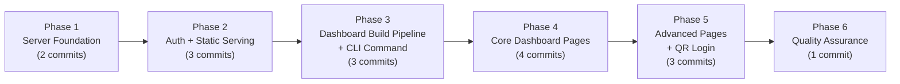

# Work Plan: Dashboard Command Implementation

Created Date: 2026-02-21
Type: feature
Estimated Duration: 8-10 days
Estimated Impact: ~25 files (5 existing modified, ~20 new)
Related Issue/PR: N/A

## Related Documents
- Design Doc: [docs/plans/dashboard-design.md](/Users/agustinsuarez/conductor/workspaces/relay/worcester/docs/plans/dashboard-design.md)
- ADR: [docs/plans/ADR-0007-dashboard-command.md](/Users/agustinsuarez/conductor/workspaces/relay/worcester/docs/plans/ADR-0007-dashboard-command.md)

## Objective

Add a `relay dashboard` CLI command that serves an embedded React-based web dashboard from the daemon's HTTP server at `127.0.0.1:3214/dashboard/*`. The dashboard provides visual feature parity with all 16 CLI commands, including interactive flows like WhatsApp QR code login, real-time transcript viewing, and instance lifecycle management.

## Background

The relay-agent CLI currently requires memorizing 16 commands with their arguments. Monitoring conversations, reading transcripts, and managing instance lifecycle requires repeated CLI invocations with no visual overview. The daemon already runs an HTTP server on port 3214 using raw `node:http`, which provides a natural mounting point for an embedded web dashboard.

Key existing state:
- `server.ts` hardcodes `Content-Type: application/json` for ALL responses (line 69) -- must be refactored
- No authentication exists on the daemon API
- No bundler exists -- `tsc` is the only build tool
- The `login.ts` command already serves HTML via a temporary SSE server on port 8787 (pattern reference)

## Phase Structure Diagram

## Task Dependency Diagram

```mermaid
graph TB
    T1A["1A: Remove hardcoded\nContent-Type from server.ts"]
    T1B["1B: Verify sendJson/sendError\nalready set Content-Type"]

    T2A["2A: Auth module\n(daemon/auth.ts)"]
    T2B["2B: Static file handler\n(daemon/static.ts)"]
    T2C["2C: Integrate auth + static\ninto server.ts request chain"]

    T3A["3A: Vite + React scaffold\n(dashboard/)"]
    T3B["3B: Build pipeline integration\n(package.json scripts)"]
    T3C["3C: Dashboard CLI command\n(commands/dashboard.ts)"]

    T4A["4A: Shared components\n(apiClient, usePolling, layout)"]
    T4B["4B: StatusPage"]
    T4C["4C: InstancesPage +\nInstanceDetailPage"]
    T4D["4D: CreateInstancePage"]

    T5A["5A: TranscriptPage"]
    T5B["5B: QR Code API endpoint\n+ LoginPage"]
    T5C["5C: ConfigPage, CallPage,\nTelegramLoginPage"]

    T6A["6A: Full E2E verification\n+ quality checks"]

    T1A --> T1B
    T1B --> T2A
    T1B --> T2B
    T2A --> T2C
    T2B --> T2C
    T2C --> T3C
    T3A --> T3B
    T3B --> T4A
    T2C --> T4A
    T4A --> T4B
    T4A --> T4C
    T4A --> T4D
    T4B --> T5A
    T4C --> T5A
    T4C --> T5B
    T4D --> T5C
    T5A --> T6A
    T5B --> T6A
    T5C --> T6A

    style T3A fill:#1a3a5c
    style T3B fill:#1a3a5c
```

## Risks and Countermeasures

### Technical Risks

- **Risk**: Server refactoring breaks existing CLI commands (removing hardcoded Content-Type)
  - **Impact**: High -- all 16 existing commands could stop working
  - **Probability**: Medium
  - **Countermeasure**: Minimal change (remove one line); verify `sendJson` and `sendError` in `routes.ts` already set Content-Type independently. Manual curl verification of all endpoints before/after. Single atomic commit for rollback.
  - **Detection**: Run `relay status`, `relay list`, `relay create` after refactoring; verify Content-Type headers with `curl -v`

- **Risk**: Dashboard bundle size exceeds 2MB gzipped budget (ADR kill criterion)
  - **Impact**: Medium -- inflates CLI package distribution
  - **Probability**: Low
  - **Countermeasure**: Monitor `vite build` output size after each page addition. Vite tree-shaking + code splitting keeps React + Tailwind ~55-75KB gzipped. Set explicit budget check in Phase 6.

- **Risk**: Vite build pipeline conflicts with existing tsc build
  - **Impact**: Medium -- could break CI/CD
  - **Probability**: Low
  - **Countermeasure**: Dashboard directory is self-contained with own `package.json` (not a workspace). `tsconfig.json` `rootDir: ./src` already excludes `dashboard/`. Build sequence: `vite build` then `tsc`.

- **Risk**: Polling overloads daemon when multiple dashboard tabs are open
  - **Impact**: Medium -- degraded API performance
  - **Probability**: Low
  - **Countermeasure**: Default polling intervals (5s status, 3s detail/transcript) are conservative. Can add tab visibility detection to pause polling on hidden tabs.

### Schedule Risks

- **Risk**: React page implementation takes longer than estimated (9 pages total)
  - **Impact**: Schedule slip by 2-3 days
  - **Countermeasure**: Phases 4 and 5 are designed so core pages (Status, Instances, Detail) are prioritized. Advanced pages (Call, Telegram, Config) can be deferred if needed without blocking the core dashboard experience.

## Implementation Phases

### Phase 1: Server Foundation Refactoring (Estimated commits: 2)

**Purpose**: Remove the hardcoded `Content-Type: application/json` from `server.ts` so the server can serve non-JSON responses. This is the prerequisite for all dashboard work.

**Design Doc AC coverage**: FR-11 (serving architecture -- API endpoints continue to respond with application/json)

#### Tasks
- [x] **1A**: Remove `res.setHeader('Content-Type', 'application/json')` from `server.ts` line 69
  - Verify that `sendJson()` in `routes.ts` (line 43-49) already sets `Content-Type: application/json` via `res.writeHead()`
  - Verify that `sendError()` uses `sendJson()` and thus also sets Content-Type correctly
  - Verify error handlers in server.ts catch blocks already set Content-Type via `res.writeHead()`
- [ ] **1B**: Run baseline verification of all existing API endpoints
  - Test `relay status`, `relay list`, `relay create`, `relay get`, `relay transcript`, `relay send`, `relay pause`, `relay resume`, `relay cancel`, `relay config` via the CLI
  - Verify all responses have `Content-Type: application/json` using `curl -v`
  - Confirm no behavioral regression
- [ ] Quality check: TypeScript builds without errors (`npm run build:cli`)

#### Phase Completion Criteria
- [ ] `server.ts` no longer sets a global Content-Type header
- [ ] All 16 existing CLI commands work identically (verified via manual testing)
- [ ] All API responses still return `Content-Type: application/json`
- [ ] `tsc` builds without errors

#### Operational Verification Procedures
1. Start daemon: `relay start`
2. Run: `curl -v http://127.0.0.1:3214/status` -- verify `Content-Type: application/json` header present, JSON body returned
3. Run: `curl -v -X POST -H "Content-Type: application/json" -d '{}' http://127.0.0.1:3214/instances` -- verify error response has correct Content-Type
4. Run: `relay list` -- verify JSON output
5. Run: `relay status` -- verify daemon status output unchanged

**Files modified**: `apps/cli/src/daemon/server.ts`

---

### Phase 2: Auth Module + Static File Handler (Estimated commits: 3)

**Purpose**: Implement the ephemeral token auth system and static file serving handler, then integrate both into the server request chain. This provides the security and serving infrastructure for the dashboard.

**Design Doc AC coverage**: FR-5 (authentication), FR-11 (static file serving, SPA fallback, MIME types)

#### Tasks
- [x] **2A**: Create `apps/cli/src/daemon/auth.ts` -- auth module
  - `generateToken()`: Uses `crypto.randomBytes(32).toString('hex')`
  - `getToken()`: Returns current token (or null if not generated)
  - `validateToken(token)`: Compares against stored token
  - `extractToken(req)`: Extracts from `Authorization: Bearer <token>` header or `?token=` query param
  - Token stored in module-level variable (never persisted to disk)
- [x] **2B**: Create `apps/cli/src/daemon/static.ts` -- static file handler
  - `handleDashboardRequest(req, res, urlPath)`: Serves files from `dist/dashboard/` directory
  - MIME type map for known extensions: `.html`, `.js`, `.css`, `.svg`, `.png`, `.ico`, `.json`, `.woff`, `.woff2`
  - SPA fallback: non-file paths (no extension or unknown extension) serve `index.html`
  - Path traversal prevention: resolved path must be within dashboard build directory
  - `Content-Security-Policy` header on HTML responses: `default-src 'self'; script-src 'self'; style-src 'self' 'unsafe-inline'; img-src 'self' data:; connect-src 'self';`
  - Cache headers: content-hashed assets (`assets/`) get `Cache-Control: public, max-age=31536000, immutable`; `index.html` gets `Cache-Control: no-cache`
- [x] **2C**: Integrate auth + static serving into `server.ts` request chain
  - Call `generateToken()` during `startServer()` after store initialization
  - Add `GET /dashboard/token` endpoint (auth-exempt) before auth checks
  - Add `/dashboard/*` prefix check with token validation, then delegate to `handleDashboardRequest()`
  - Add auth validation for API requests that include `Authorization` header (backward compat: requests without header pass through)
  - Skip `parseJsonBody` for `/dashboard/*` GET requests
  - Log token generation at INFO level (without token value) via pino
  - Log auth failures at WARN level with request URL
- [x] Quality check: TypeScript builds without errors

#### Phase Completion Criteria
- [x] Auth module generates and validates tokens correctly
- [x] Static file handler serves files with correct MIME types
- [x] Path traversal attempts are blocked (403 response)
- [x] SPA fallback routing works (non-file paths return index.html)
- [x] Existing CLI commands continue to work without auth headers
- [x] API requests with invalid Authorization header receive 401
- [x] `tsc` builds without errors

#### Operational Verification Procedures
1. Start daemon: `relay start`
2. Verify token endpoint: `curl http://127.0.0.1:3214/dashboard/token` -- should return `{"token":"...","expires":null}`
3. Verify auth required: `curl http://127.0.0.1:3214/dashboard/` -- should return 401
4. Verify auth works: `curl -H "Authorization: Bearer <token>" http://127.0.0.1:3214/dashboard/` -- should return HTML (or 404 if not built yet)
5. Verify backward compat: `curl http://127.0.0.1:3214/status` -- should return 200 (no auth required)
6. Verify invalid auth rejected: `curl -H "Authorization: Bearer invalid" http://127.0.0.1:3214/status` -- should return 401
7. Verify path traversal blocked: `curl -H "Authorization: Bearer <token>" http://127.0.0.1:3214/dashboard/../../package.json` -- should return 403 or serve index.html (not the actual file)

**New files**: `apps/cli/src/daemon/auth.ts`, `apps/cli/src/daemon/static.ts`
**Modified files**: `apps/cli/src/daemon/server.ts`

---

### Phase 3: Dashboard Build Pipeline + CLI Command (Estimated commits: 3)

**Purpose**: Set up the Vite + React project scaffold, integrate with the CLI build pipeline, and implement the `relay dashboard` CLI command. After this phase, `relay dashboard` opens a working (minimal) dashboard in the browser.

**Design Doc AC coverage**: FR-1 (dashboard command), FR-6 (served on port 3214 under /dashboard/*)

#### Tasks
- [x] **3A**: Create Vite + React scaffold at `apps/cli/dashboard/`
  - `dashboard/package.json`: React, React DOM, React Router, Tailwind CSS v4, Vite as devDependency
  - `dashboard/vite.config.ts`: `base: '/dashboard/'`, `outDir: '../dist/dashboard'`, `emptyOutDir: true`
  - `dashboard/tsconfig.json`: Strict mode, JSX support
  - `dashboard/index.html`: SPA entry with `
`
  - `dashboard/src/main.tsx`: React entry point, renders App
  - `dashboard/src/App.tsx`: React Router with placeholder routes
  - Brand styling: dark `#0a0a0a` background, JetBrains Mono, glass UI aesthetic, muted blue/cyan accents
  - `dashboard/src/index.css`: Tailwind imports + brand design tokens
- [x] **3B**: Update `apps/cli/package.json` build scripts
  - Add `"build:dashboard": "cd dashboard && npm install && npx vite build"`
  - Update `"build"` to: `"npm run build:dashboard && tsc"`
  - Verify `tsc` still compiles successfully (dashboard/ excluded by rootDir)
  - Verify `vite build` outputs to `dist/dashboard/`
- [x] **3C**: Create `apps/cli/src/commands/dashboard.ts` -- CLI command
  - `registerDashboardCommand(program)`: Registers `relay dashboard` command
  - Check daemon liveness via `GET /status` (reuse `daemonRequest` from `client.ts`)
  - If daemon not running: print "Daemon not running. Run `relay start` first." and exit with code 1
  - Retrieve token via `GET /dashboard/token`
  - Print dashboard URL to stdout: `http://127.0.0.1:3214/dashboard/?token=<token>`
  - Open browser using platform-appropriate command (`open` on macOS, `xdg-open` on Linux, `start` on Windows)
  - Register in `apps/cli/src/index.ts`: add import and `registerDashboardCommand(program)` call
- [x] Quality check: Full build succeeds (`npm run build` from `apps/cli/`)

#### Phase Completion Criteria
- [x] `cd apps/cli/dashboard && npx vite build` produces static files in `apps/cli/dist/dashboard/`
- [x] `npm run build` from `apps/cli/` runs both Vite and tsc successfully
- [x] `relay dashboard` checks daemon liveness, retrieves token, prints URL, opens browser
- [ ] Dashboard loads in browser showing a minimal placeholder page
- [x] `relay --help` lists the `dashboard` command
- [x] `tsc` builds without errors

#### Operational Verification Procedures
1. Build: `cd apps/cli && npm run build` -- verify both dashboard and tsc succeed
2. Check output: `ls apps/cli/dist/dashboard/` -- verify `index.html` and `assets/` directory exist
3. Start daemon: `relay start`
4. Run: `relay dashboard` -- verify URL printed, browser opens, dashboard loads
5. Verify dashboard page in browser shows at `http://127.0.0.1:3214/dashboard/`
6. Run: `relay --help` -- verify `dashboard` command listed

**New files**: `apps/cli/dashboard/` (entire Vite project), `apps/cli/src/commands/dashboard.ts`
**Modified files**: `apps/cli/package.json`, `apps/cli/src/index.ts`

---

### Phase 4: Core Dashboard Pages (Estimated commits: 4)

**Purpose**: Implement the shared component library and the most critical dashboard pages: Status, Instances list, Instance detail (with actions), and Create Instance form.

**Design Doc AC coverage**: FR-2 (feature parity -- core operations), FR-4 (real-time polling), FR-7 (message sending)

#### Tasks
- [x] **4A**: Create shared components and utilities
  - `dashboard/src/lib/api.ts`: API client wrapper
    - Reads token from `sessionStorage` (extracted from URL `?token=` on first load)
    - All requests include `Authorization: Bearer <token>` header
    - Error handling: 401 triggers "Session expired" message
    - Connection failure shows "Cannot reach daemon" with retry
  - `dashboard/src/hooks/usePolling.ts`: Generic polling hook
    - Accepts endpoint URL, interval (ms), and enabled flag
    - Returns `{ data, loading, error, refresh }`
    - Pauses when browser tab is hidden (visibility API)
    - Implements exponential backoff on consecutive failures
  - `dashboard/src/components/DashboardLayout.tsx`: Main layout
    - Sidebar navigation with all operation links
    - Header with WhatsApp/Telegram connection status indicators
    - Content area with React Router `<Outlet />`
  - `dashboard/src/components/StateBadge.tsx`: Instance state display
    - Color-coded badge for all 11 states (CREATED, QUEUED, ACTIVE, WAITING_FOR_REPLY, WAITING_FOR_AGENT, PAUSED, COMPLETED, FAILED, ABANDONED, CANCELLED, EXPIRED)
  - `dashboard/src/components/ChannelBadge.tsx`: Channel indicator (whatsapp, telegram, phone)
  - `dashboard/src/components/TodoList.tsx`: Todo item list with status indicators
  - `dashboard/src/components/InstanceTable.tsx`: Sortable instance table
- [x] **4B**: Implement `StatusPage`
  - Display daemon status: PID, uptime, WhatsApp connected, Telegram connected
  - Display instance counts by state
  - Display active session count, heartbeat timer count
  - Poll `GET /status` every 5 seconds via `usePolling`
  - AC: FR-4 -- status indicators update every 5 seconds
- [x] **4C**: Implement `InstancesPage` + `InstanceDetailPage`
  - **InstancesPage**: Table of all instances with state badges, channel badges, links to detail
    - Poll `GET /instances` every 5 seconds
    - Filter/sort by state
  - **InstanceDetailPage**: Full instance view
    - Display: state, objective, target contact, todos with status, heartbeat config, channel
    - Action buttons: Pause, Resume, Cancel (enabled/disabled based on state)
    - Message send input (POST `/instances/:id/send`) -- disabled when state does not accept messages
    - Poll `GET /instances/:id` every 3 seconds
    - AC: FR-2 (instance operations), FR-7 (message sending)
- [x] **4D**: Implement `CreateInstancePage`
  - Form fields: objective (textarea), target_contact (E.164 input), todos (dynamic add/remove list), channel (select: whatsapp/telegram/phone), heartbeat_config (interval, max_attempts)
  - Submit via `POST /instances`
  - Success: redirect to instance detail page
  - Validation: required fields, E.164 format for phone
  - AC: FR-2 (create instance form)
- [ ] Quality check: All pages render correctly, polling works, actions execute

#### Phase Completion Criteria
- [ ] API client handles auth token lifecycle (extract from URL, store in sessionStorage, send as Bearer)
- [ ] Polling hook correctly polls at configured intervals, pauses on hidden tab
- [x] StatusPage displays daemon status with 5-second polling
- [x] InstancesPage lists all instances with state/channel badges
- [x] InstanceDetailPage shows full instance data with working Pause/Resume/Cancel/Send actions
- [ ] CreateInstancePage form submits and creates instances
- [ ] Navigation sidebar links to all pages
- [ ] Build succeeds: `npm run build` from `apps/cli/`

#### Operational Verification Procedures
1. Build and start daemon: `cd apps/cli && npm run build && relay start`
2. Open dashboard: `relay dashboard`
3. Verify StatusPage: compare displayed values with `relay status` output
4. Create an instance via dashboard form, verify it appears in `relay list`
5. Navigate to instance detail, verify state badge and data match `relay get <id>`
6. Click Pause on an active instance, verify state changes to PAUSED
7. Click Resume, verify state returns to previous
8. Send a message from the detail page, verify it appears in `relay transcript <id>`
9. Verify polling: wait 5+ seconds on status page, confirm uptime updates

**New files**: Multiple files under `apps/cli/dashboard/src/` (lib/api.ts, hooks/usePolling.ts, components/*, pages/StatusPage.tsx, pages/InstancesPage.tsx, pages/InstanceDetailPage.tsx, pages/CreateInstancePage.tsx)

---

### Phase 5: Advanced Pages + QR Login (Estimated commits: 3)

**Purpose**: Implement the remaining dashboard pages: Transcript view, QR code login, Config, Call, and Telegram login. This completes full feature parity with all 16 CLI commands.

**Design Doc AC coverage**: FR-3 (QR code login), FR-6 (transcript viewing), FR-8 (config operations), FR-9 (call command), FR-10 (telegram login)

#### Tasks
- [x] **5A**: Implement `TranscriptPage`
  - Chat-style scrollable view with sender, timestamp, message content
  - Poll `GET /instances/:id/transcript` every 3 seconds
  - Append new messages without losing scroll position (track scroll state)
  - Display message direction (inbound vs outbound) with visual distinction
  - AC: FR-6 (transcript viewing with real-time updates)
- [x] **5B**: QR Code API endpoint + `LoginPage`
  - **Backend**: Add `GET /api/login/qr` endpoint to `routes.ts`
    - Returns `{ qr: string | null, generated_at: string | null, connected: boolean, status: 'waiting' | 'scanning' | 'connected' | 'disconnected' }`
    - Add module-level QR data storage in `whatsapp/connection.ts` with getter function
    - Add `POST /api/login/connect` endpoint to trigger WhatsApp connection
  - **Frontend**: `LoginPage` component
    - WhatsApp tab: QR code display that polls `GET /api/login/qr` every 3 seconds
    - Render QR code as image (use a lightweight QR renderer library, or render as SVG/canvas)
    - Show connection status indicator
    - On successful connection: display success message, update header status
    - AC: FR-3 (QR code renders, refreshes, success on scan)
- [ ] **5C**: Implement remaining pages
  - **ConfigPage**: Display current config via `GET /config`, edit form, save via `POST /config`
    - AC: FR-8 (config display and edit)
  - **CallPage**: Form with target phone number (E.164) and objective, submit via `POST /call`
    - AC: FR-9 (call form and initiation)
  - **TelegramLoginPage**: Telegram auth flow via `POST /telegram/login`, display status
    - AC: FR-10 (telegram auth flow)
- [ ] Quality check: All pages render, QR flow works end-to-end, build succeeds

#### Phase Completion Criteria
- [ ] TranscriptPage shows messages in chat-style view with 3-second polling
- [ ] New messages append without scroll position loss
- [ ] QR code renders in browser and refreshes when new QR is generated
- [ ] WhatsApp connection status updates in dashboard after successful QR scan
- [x] ConfigPage displays and saves configuration
- [x] CallPage form submits call initiation
- [x] TelegramLoginPage triggers auth flow
- [ ] All 9 dashboard pages functional
- [ ] Build succeeds: `npm run build` from `apps/cli/`

#### Operational Verification Procedures
1. Build and start daemon: `cd apps/cli && npm run build && relay start`
2. Open dashboard: `relay dashboard`
3. **Transcript**: Navigate to a transcript page, verify messages match `relay transcript <id>`, wait for polling update
4. **QR Login**: Navigate to Login page, click "Connect WhatsApp", verify QR code appears, scan with phone, verify status changes to "connected" in dashboard
5. **Config**: Navigate to Config page, verify settings match `relay config`, edit a value, save, verify change via `relay config`
6. **Call**: Navigate to Call page, fill form, verify submission reaches daemon (check daemon logs)
7. **Telegram**: Navigate to Telegram Login, verify auth flow triggers

**New files**: `apps/cli/dashboard/src/pages/TranscriptPage.tsx`, `LoginPage.tsx`, `ConfigPage.tsx`, `CallPage.tsx`, `TelegramLoginPage.tsx`, `components/QRCodeDisplay.tsx`, `components/TranscriptView.tsx`
**Modified files**: `apps/cli/src/daemon/routes.ts` (QR endpoint), `apps/cli/src/whatsapp/connection.ts` (QR data getter)

---

### Phase 6: Quality Assurance (Required) (Estimated commits: 1)

**Purpose**: Full end-to-end verification, acceptance criteria audit, bundle size check, and final quality pass.

#### Tasks
- [ ] Verify ALL Design Doc acceptance criteria achieved (FR-1 through FR-11)
- [ ] Full E2E workflow test:
  1. `relay start` -- daemon starts
  2. `relay dashboard` -- browser opens with token, dashboard loads
  3. StatusPage shows correct daemon info
  4. Create instance via dashboard form
  5. View instance in list, click to detail
  6. View transcript in real-time
  7. Pause instance, verify state change
  8. Resume instance, verify state change
  9. Send message from detail page
  10. Cancel instance, verify terminal state
  11. All existing CLI commands still work identically
- [ ] Bundle size check: `cd apps/cli/dashboard && npx vite build` -- verify total gzipped output < 2MB (ADR kill criterion)
- [ ] Quality checks:
  - [ ] TypeScript strict mode passes for both daemon and dashboard
  - [ ] `npm run build` from `apps/cli/` succeeds cleanly
  - [ ] No console errors in browser during dashboard usage
- [ ] Backward compatibility verification:
  - [ ] All 16 existing CLI commands work identically (spot check at minimum: status, list, create, get, transcript, send, pause, resume, cancel, config)
  - [ ] Existing API responses have unchanged structure and Content-Type headers
  - [ ] CLI commands work without any auth headers (backward compat)
- [ ] Security verification:
  - [ ] Dashboard rejected without token (401)
  - [ ] Path traversal blocked (403 or index.html fallback)
  - [ ] API with invalid Authorization header returns 401
  - [ ] API without Authorization header passes through
  - [ ] Content-Security-Policy header present on HTML responses
- [ ] Documentation: Verify ADR-0007 status can be updated to "Accepted"

#### Phase Completion Criteria
- [ ] All FR-1 through FR-11 acceptance criteria checked off
- [ ] Full E2E workflow passes without errors
- [ ] Bundle size under 2MB gzipped
- [ ] TypeScript compiles with zero errors (strict mode)
- [ ] No regressions in existing CLI commands
- [ ] Security checks all pass

#### Operational Verification Procedures
(Full E2E verification from Design Doc test strategy)

1. **Foundation**: `relay start` succeeds, `curl -v http://127.0.0.1:3214/status` returns JSON with correct Content-Type
2. **Auth + Static**: `curl http://127.0.0.1:3214/dashboard/` returns 401; `curl -H "Authorization: Bearer <token>" http://127.0.0.1:3214/dashboard/` returns HTML
3. **Feature Parity**: Each dashboard page verified against equivalent CLI command output
4. **Full Workflow**: Start daemon -> `relay dashboard` -> create instance -> view transcript -> pause/resume -> cancel; all via dashboard UI
5. **Backward Compat**: Run all 16 CLI commands, verify identical behavior to pre-dashboard baseline

## Completion Criteria
- [ ] All phases completed (Phase 1-6)
- [ ] Each phase's operational verification procedures executed
- [ ] All Design Doc acceptance criteria (FR-1 through FR-11) satisfied
- [ ] Quality checks completed (zero TypeScript errors, build succeeds)
- [ ] Bundle size under 2MB gzipped
- [ ] All 16 existing CLI commands work identically (backward compatibility)
- [ ] Security model verified (auth, path traversal, CSP)
- [ ] User review approval obtained

## Progress Tracking

### Phase 1: Server Foundation
- Start: 2026-02-21
- Complete:
- Notes: Task 1A completed -- removed hardcoded Content-Type from server.ts. TypeScript builds without errors.

### Phase 2: Auth + Static Serving
- Start: 2026-02-21
- Complete: 2026-02-21
- Notes: All tasks (2A, 2B, 2C) completed. Auth module, static file handler, and server.ts integration all done. Token generated on daemon startup, /dashboard/token auth-exempt endpoint, /dashboard/* routes require auth, API backward compat preserved. TypeScript builds without errors.

### Phase 3: Build Pipeline + CLI Command
- Start: 2026-02-21
- Complete: 2026-02-21
- Notes: Task 3A completed -- Vite + React scaffold created at apps/cli/dashboard/ with all files. npm install and vite build both succeed. Output in apps/cli/dist/dashboard/. Note: index.html script src uses /src/main.tsx (not /dashboard/src/main.tsx) because Vite applies the base path automatically during build. Tasks 3B and 3C completed -- build scripts updated (build:dashboard runs Vite before tsc), dashboard CLI command created at src/commands/dashboard.ts (checks daemon liveness, retrieves token, prints URL, opens browser), registered in index.ts. Full build pipeline succeeds. relay --help lists dashboard command.

### Phase 4: Core Dashboard Pages
- Start: 2026-02-21
- Complete:
- Notes: Task 4A completed -- shared components and utilities created: api.ts (API client with token auth, error handling), usePolling.ts (polling hook with visibility pause, exponential backoff), DashboardLayout.tsx (sidebar nav, header with connection status, Outlet), StateBadge.tsx (11 states), ChannelBadge.tsx (whatsapp/telegram/phone), TodoList.tsx (status indicators), InstanceTable.tsx (table with badges and links). App.tsx updated with layout wrapper and all placeholder routes. Vite build succeeds (236KB JS, 19KB CSS gzipped: 80KB total).

### Phase 5: Advanced Pages + QR Login
- Start:
- Complete:
- Notes:

### Phase 6: Quality Assurance
- Start:
- Complete:
- Notes:

## Notes

- **No test framework**: The project has no test framework configured. All verification is manual and script-based per Design Doc test strategy. Future work may add Vitest for the dashboard.
- **Dashboard is not a workspace**: `apps/cli/dashboard/` has its own `package.json` but is NOT registered as an npm workspace. Dependencies are installed separately via `cd dashboard && npm install`.
- **Parallel work**: Phase 3A (Vite scaffold) can be started in parallel with Phase 2 since it has no dependency on auth/static serving. The dependency diagram reflects this -- 3A and 3B only block on 3B needing Vite to be scaffolded.
- **Strategy B (Implementation-First)**: Since no test framework or test design information exists, this plan follows Strategy B -- implementation-first with manual verification at each phase.
- **Existing commands unchanged**: The 16 existing CLI commands and their API contracts are explicitly in the non-scope. Only additive changes to the server request chain.
